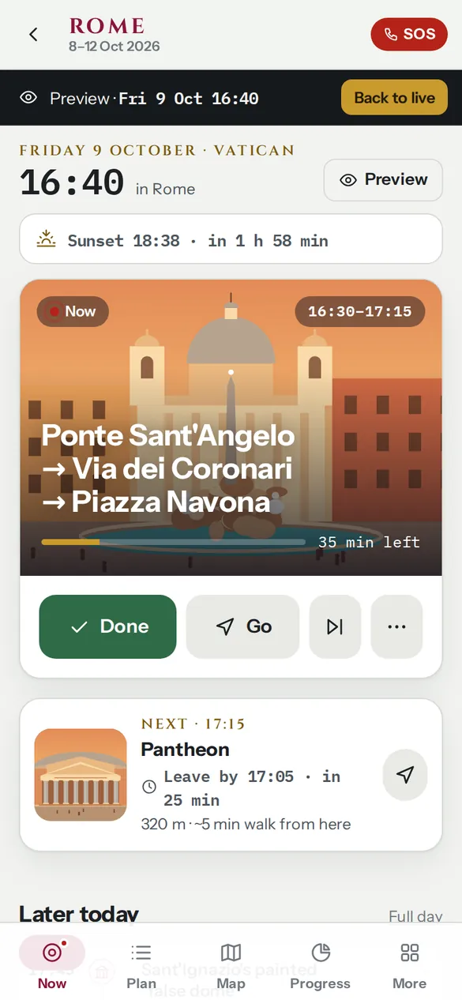
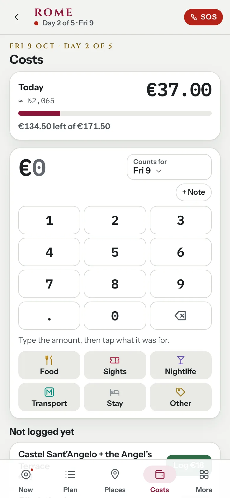
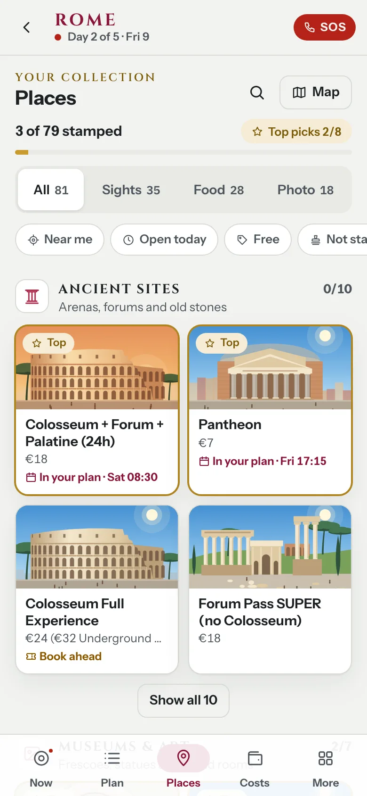
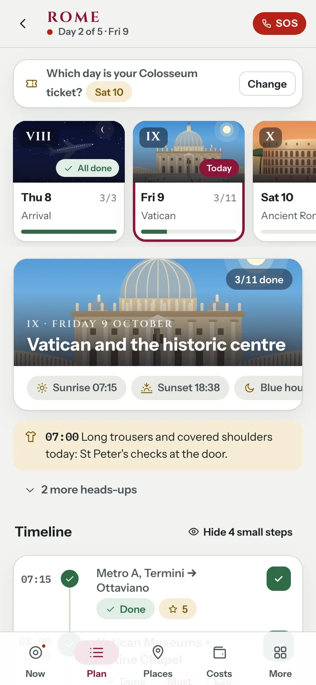
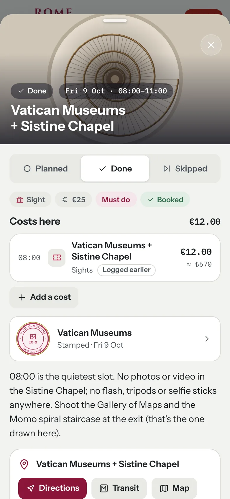
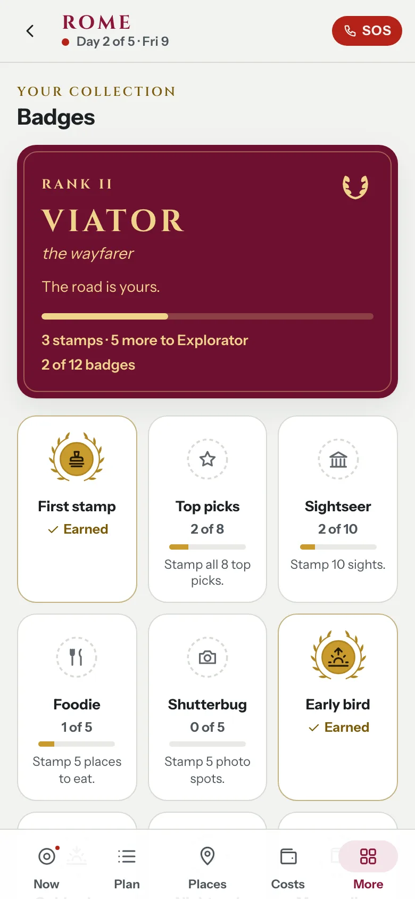
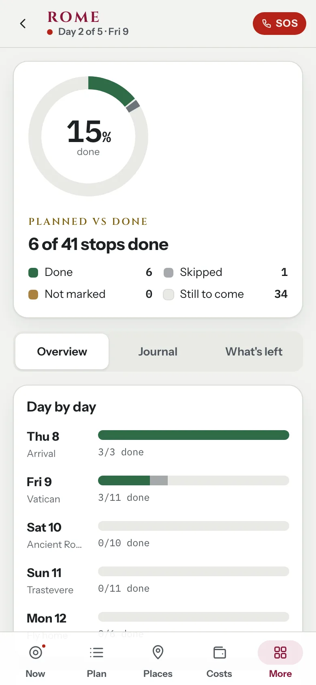
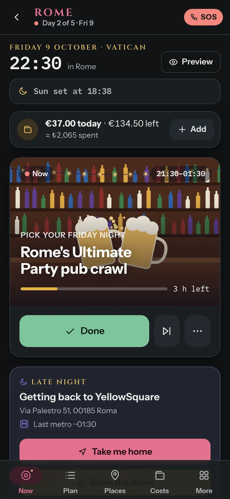
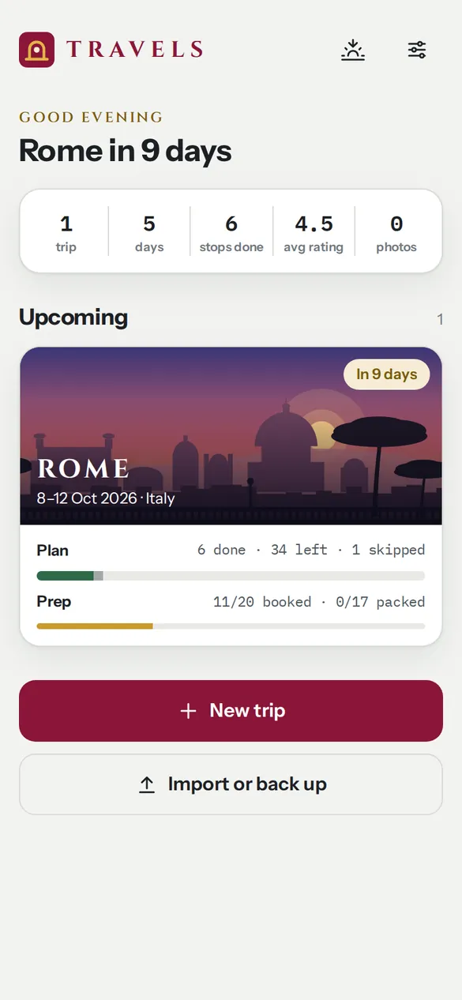
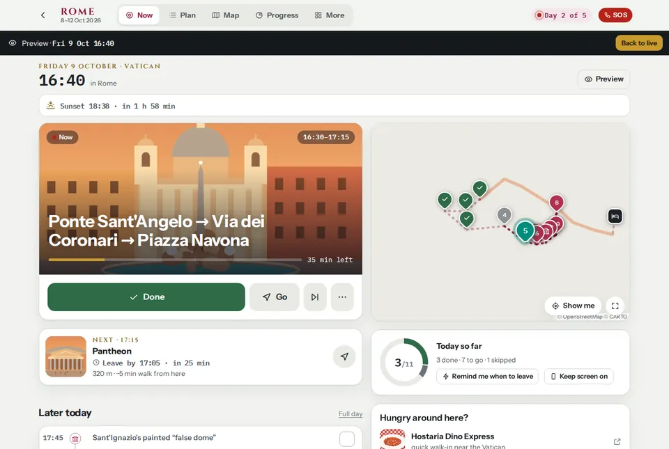

# Travels

A trip companion that tells you **what to do right now**, follows you on the map, and keeps track of **what you planned, what you did and what's left**, across all your trips.

It ships with a full 5-day plan for **Rome, 8–12 October 2026** (first trip abroad, solo, social hostel) and you can add your own trips.

<p>
  
  
  
</p>

A trip has five tabs, the same five as top tabs on a laptop: **Now**, **Plan**, **Places**, **Costs** and **More**.

## What it does

**Now**: the live guide for this exact moment
- During the trip, today's money in one row ("€37.00 today · €134.50 left", ≈ ₺ spent) with **Add** for a cost.
- The stop you should be at, how long it has left, and a one-tap **Done**, **Skip** or **Go** (Google Maps directions).
- The next stop with a **leave-by time**, worked out from where you are (or the previous stop, or your hostel) with a walking or transit estimate.
- "Time to go" when a gap is ending, "free time" when it isn't, and a clear end-of-day screen with a day rating.
- Timed alerts for the day (dress code, sunset, last metro) and **leave reminders** (a notification or in-app nudge while the app is open).
- **Did you do these?**: earlier stops you haven't marked, one tap each.
- A live map that **follows you** (GPS dot, accuracy ring, compass heading where the phone has one) with today's route, plus an arrow and distance to your next stop.
- **Getting back**: late at night a card with directions home, the address card for a taxi driver and a taxi number.
- **Preview any moment** of the trip before you go ("what will it tell me on Friday at 16:40?"). Add `?at=2026-10-09T16:40` to the Now URL to jump there.
- Before the trip it becomes a countdown with what to book now and your packing progress; after it, a summary of the trip.

**Plan**: day by day
- Timeline per day with times, costs, must-do / optional / skip-if-tired tags and small logistics steps you can hide.
- Stops with options ("Pick your ride into Rome", "Pick your Friday night") where you choose one and the rest of the app follows your choice.
- Trip-wide variants: switching the Colosseum from Saturday to Sunday rearranges both days.
- Add, edit, move or delete stops; drop a pin on the map, use your location or paste a Google Maps link.
- **Your day**: rate it, keep a day journal, and see what you spent that day against its plan.
- Every tick, here or anywhere else, gives the same toast with **Undo**, names any stamp it earned, and offers **Log €7** when the stop has one fixed price and nothing is logged for it yet.

**Costs**: the money page
- A keypad for the amount, then one tap on what it was for (Food, Sights, Nightlife, Transport, Stay or Other) saves the cost: no form, and the phone's keyboard only for an optional note.
- Today against the day's plan (before the trip: your budget; after it: all in), with the amount in lira beside it, and **Not logged yet**: today's done stops with a price and no cost yet, with **Log €18** or **Add**.
- Costs by day (tap one to change or delete it), the trip so far against the plan, by kind, and everything with the rate used.
- Quick add from Now, from Plan's *Your day*, from any stop (the cost is linked to it) and from a ticked booking. Costs logged while previewing are marked and can be removed together.

**Places**: a collection
- The trip's 81 places (sights, food, photo spots) as small cards in sets such as *Ancient sites*, *Churches* or *Pizza & street food*, with search and filters (Near me, Open today, Free, Not stamped, Top picks) and a map of them all.
- A place gets a **stamp** when you tick a stop there, or by hand from the first day of the trip (**I was here**, **I ate here**, **Got the shot**). Each stamp is drawn for its place, with the date in Roman numerals. A set turns gold once every place in it is stamped.
- Each place opens a sheet with its price, booking, open days, where it sits in your plan and directions, and **Add to plan**.

**Badges and rank**: a light game, all from what you already do
- Your stamps give you a rank, from *Peregrinus* (the newcomer) to *Imperator*, and badges (12 on the Rome trip) such as Early bird, Golden hour, Critic or Money diary. A gold toast celebrates each new one once; the Badges page shows them all with stamps by day.

**More**: everything else, grouped
- The *Your trip* card (stops done, rank, stamps, badges) leads to **Progress & journal**: planned vs done vs skipped vs not marked vs still to come, per day and per kind, a money summary, your top-rated stops, the journal with notes, photos and costs (download it as Markdown) and **What's left**.
- *Get ready*: bookings with due dates and tick-offs, and a packing list. *Find your way*: the full map (days, places and the metro), the guide (money with a converter, phone, safety, getting around, departure day, useful Italian you can listen to) and Notes & chats. *Help and settings*: an SOS screen with tap-to-call numbers and a card to show a taxi driver, and trip settings.
- On a stop: rate it, tag it (Loved it, Hidden gem, Too crowded…), write a note, add photos, and see its costs and stamps.

**All your trips** on one home screen, with progress bars for the plan and for your preparation.

**Notes & chats**: research, tips and chat logs saved from conversations with Claude, readable in the app (home screen, `/notes`, and each trip's *More* tab). They're Markdown files in [`content/notes`](content/notes).

<p>
  
  
  
</p>
<p>
  
  
  
</p>
<p>
  
</p>

## Your account, sync and offline

- **Works without an account.** Trips and progress live on the device (`localStorage`), photos in IndexedDB, and everything works offline.
- **Sign in with Google** (*Settings → Your account*) to keep a copy in your own Firebase project: trips and progress in Firestore, photos in Cloud Storage. Every device you sign in on stays in step; changes made offline sync when you're back online, and edits made on two devices are merged (ticks, ratings, notes and photos from both are kept, and costs and stamps are merged one by one, a deleted cost staying deleted).
- **Only you.** The first Google account that signs in owns the app; the security rules (`firebase/`) refuse every other account. The setup script can also lock sign-up to your account.
- **Google Maps**: the map uses Google's tiles (Map Tiles API) and the live guide asks Google (Routes API) for real walking and transit times, including which metro or bus to catch for "leave by". Offline, the guide falls back to its own estimates and the map to OpenStreetMap, showing the areas you looked at with OpenStreetMap on (the service worker keeps the tiles you viewed, never more, per the OpenStreetMap tile policy). To have the map offline, choose OpenStreetMap in *Settings → Map* before the trip and look around the areas you'll visit.
- It's an installable PWA: add it to your home screen and it opens full screen.
- **Back up** from *Settings → Export everything* if you want a file of your own; *Import a backup* merges it with what's on the device.

## Saving chats and trips from Claude

Everything the app shows lives in this repository, so a chat can add to it:

- **Notes** go in `content/notes/YYYY-MM-DD-slug.md` with a small front matter (title, date, kind, trip, summary, tags).
- **Trips** go in `app/data/<trip>.ts` and are listed in `app/data/trips.ts`.

The formats and rules (stable stop ids, real coordinates, what never to publish) are in **[docs/content-guide.md](docs/content-guide.md)**. After a push to `main` the site redeploys in about two minutes. Phones pick up trip changes by themselves: a trip nobody changed updates quietly; one changed on the phone gets an *Update / Keep mine* banner that keeps the person's ticks, notes, photos and own stops.

## Develop

```bash
npm install
npm run dev        # http://localhost:3000
npm test           # unit tests (time, geo, plan, guide, notes, costs, places, game, sync, trip data)
npm run typecheck
npm run generate   # static site in .output/public
```

Browser checks on a phone-sized Chromium (Playwright, installed without saving it, as in CI: `npm i --no-save playwright@1 && npx playwright install chromium`). Each runs against `TRAVELS_URL`, or the dev server:

```bash
node tests/e2e/costs.e2e.mjs     # the Costs page, the cost pad and sheet, costs on a stop
node tests/e2e/places.e2e.mjs    # Places, the place sheet, the map, the stop editor (--build adds the offline map)
node tests/e2e/game.e2e.mjs      # tabs, header, More, Badges, celebrations, Progress
node tests/e2e/day.e2e.mjs       # Now, Plan, bookings, packing, the driver card
node tests/e2e/ui.e2e.mjs        # across screens: lit tabs, sideways scroll, touch targets, contrast, offline map
node tests/e2e/ui.e2e.mjs --build              # serves .output/public itself
SHOTS=1 node tests/e2e/ui.e2e.mjs --build      # writes docs/screenshots/*.webp (needs cwebp)
```

`tests/e2e/lib.mjs` holds their shared helpers (a phone, the seeded test state, a frozen clock, a static server for the build); run on its own it is a smoke test of every trip page.

Stack: Nuxt 4 (client-side SPA, static generation), Vue 3, VueUse, Leaflet with Google Map Tiles or OpenStreetMap tiles, Firebase (Auth, Firestore, Storage, Hosting), Google Routes API, idb-keyval, `@vite-pwa/nuxt`, Vitest, Playwright. The illustrations, stamps and badge seals are original hand-coded SVG, the illustrations lit for the time of day.

### Project layout

```
app/
  pages/            index (all trips), trips/new, settings,
                    trips/[id]/{now,plan,places,costs,more,map,progress,badges,bookings,packing,guide,notes,sos,settings}
  components/       MapView (Leaflet), StopSheet, StopEditor, FeedbackEditor, CostPad, CostSheet, PlaceTile,
                    PlaceSheet, StampMark, BadgeSeal, RankCard, GameHost (celebrations), HomeCard, DayStrip, …
  composables/      useTrips, useProgress, useTripView, useTripActions (ticks, costs, stamps), useGame,
                    useClock, useGeo, useLiveAlerts, usePhotos, useCloud (sign-in and sync),
                    useGoogleMaps (tiles and routes), …
  lib/firebase.ts   Firebase, loaded only once you sign in
  data/trips.ts     the trips that ship with the app (rome.ts is the Rome plan)
  data/notes.ts     loads content/notes/*.md
  utils/            illustration engine, icons, map helpers, UI helpers
shared/
  types/trip.ts     the data model
  utils/            time (trip clock, time zones), geo, plan (states, progress), guide (live guide), text,
                    costs (the ledger), places (sets and stamps), game (rank and badges),
                    sync (what to upload, download or merge)
tests/              Vitest (including checks of every trip's data); e2e/ has the browser checks, and
                    cloud.e2e.mjs runs against the Firebase emulators
firebase/           Firestore and Storage security rules
scripts/            one-time Google Cloud setup
content/notes/      notes and chat logs (Markdown)
public/archive/     standalone pages kept as they were
docs/               content guide and screenshots
```

### Add a trip that ships with the app

Create `app/data/<trip>.ts` exporting a `Trip` (see `shared/types/trip.ts`; `app/data/rome.ts` is a complete example) and add it to `SEED_TRIPS` in `app/data/trips.ts`. See [docs/content-guide.md](docs/content-guide.md). Seeded trips follow newer versions pushed here, and can be reset to the original from *Trip settings*.

Places sort themselves into sets and stops find their places by name, so a new trip needs nothing extra for the collection and the game. Two optional fields cover what the matching can't: `set` on a place (which set it belongs to) and `placeId` on a stop or an option (which place it is, so ticking it stamps that place).

## Deploy

The workflow in `.github/workflows/deploy.yml` tests and builds on every push to `main`, then publishes:

- **Firebase Hosting** (the app's home, with sign-in and sync): https://travela-emre.firebaseapp.com. GitHub signs in to Google without any stored key (Workload Identity Federation) and deploys the site plus the Firestore and Storage security rules. This job runs once `.github/firebase-ready` exists.
- **GitHub Pages**: https://mrshn.github.io/travel-app-website/, a copy that points to the Firebase address once it's live (`firebaseLive` in `app/app.config.ts`).

`.github/workflows/cloud-tests.yml` runs sign-in, two-device sync, offline merging (costs logged, edited and deleted on two devices included), photo backup and the security rules against the Firebase emulators.

### One-time Google Cloud setup

Run this in a terminal (your computer's, or Cloud Shell) and follow the prompts:

```bash
curl -sL https://raw.githubusercontent.com/mrshn/travel-app-website/main/scripts/setup-google-cloud.sh | bash
```

It signs you in with the Google account that owns the Firebase project (in its own gcloud profile), asks before linking a billing account (the Blaze plan, needed for photo storage and Google Maps; one person stays inside the free tiers), turns on Google sign-in, creates the database, the hosting site and the photo bucket, lets only this repository deploy, locks the Maps key to the app's addresses with daily caps, and adds a spending alert. Safe to run again.

## Credits

Map data and map tiles © [OpenStreetMap](https://www.openstreetmap.org/copyright) contributors, served by the OpenStreetMap Foundation's tile servers (tile.openstreetmap.org) under their [tile usage policy](https://operations.osmfoundation.org/policies/tiles/); Google Maps tiles and routes © Google. Fonts: Cinzel, Instrument Sans and IBM Plex Mono (SIL Open Font License), bundled via Fontsource. Trip facts were researched in September 2026; check opening times and rules before you go.
